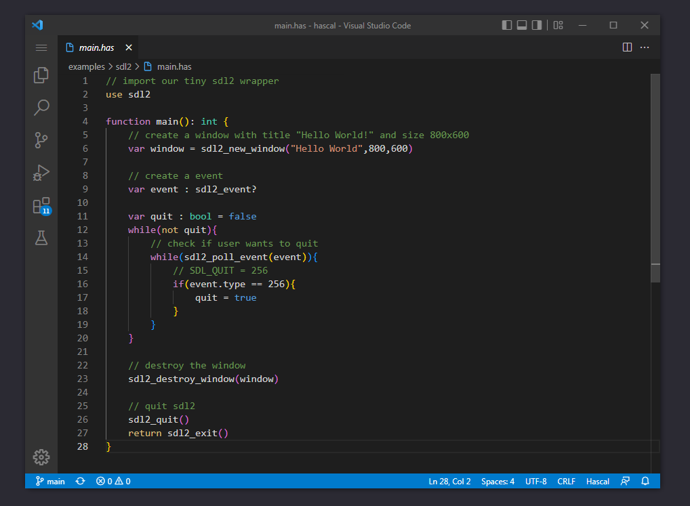

# Sacalon for VSCODE



Sacalon VSCODE extension

## Installation
- Download sacalon `.vsix` file from [the releases page](https://github.com/sacalon/vscode/releases)
- Run following command in your terminal:
```
code --install-extension <path-to-downloaded-vsix-file>
```

## Todo

- [ ] Release on marketplace
